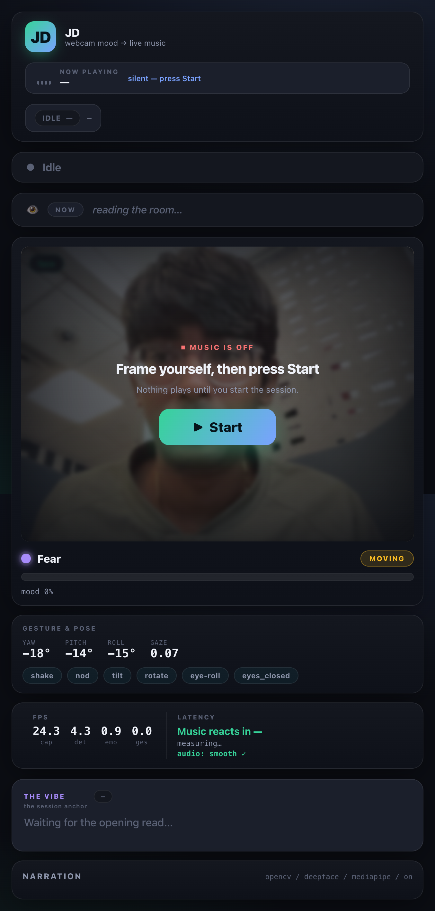

# 🪞 MoodMirror

**Look into the mirror — it plays your mood.** MoodMirror reads your face and live gestures from the webcam and generates music that reacts to you in real time.



## What it does

- **👁 Continuous Gemini mood reading** — every few seconds (you set the interval on the dashboard) Gemini looks at the webcam, understands your current mood/situation, and steers the music to match.
- **🎛 Two modes:**
  - **Local — Magenta RealTime (MRT2):** a fully-offline, *instant* instrumental stream that morphs to your mood with ~1s latency.
  - **🎤 Suno — full song:** snapshots the moment → Gemini writes a song brief → Suno produces a fully-produced song (with vocals) → it auto-plays when ready (you can stop it anytime). The dashboard shows live progress.
- **🙂 Local emotion + micro-gestures (offline):** OpenCV + DeepFace read your expression; MediaPipe reads head pose and fires gestures — **nod** (punchy groove), **shake** (wobbly), **tilt** (playful), **turn away** (distant), **eye-roll** (bright), **eyes closed** (deep & slow) — each mapped to a distinct sound.
- **🎚 Live dashboard:** webcam + emotion/gesture overlays, the "NOW" Gemini read, a narration feed, FPS + music-reaction-latency meters, an audio-health indicator, and a **Start / Start-Again** flow (nothing plays until you press Start).

## Architecture

Webcam → vision → emotion/gesture → narrator/Gemini → music, on background daemon threads:

| module | role |
|---|---|
| `jd/music.py` | streaming MRT2 engine (ring buffer, persistent state, native-48k out) + Suno song playback |
| `jd/vision.py` | OpenCV Haar face + motion |
| `jd/emotion_worker.py` / `emotion_proc.py` | DeepFace 7-class emotion (own subprocess) |
| `jd/gesture_worker.py` / `gesture_proc.py` | MediaPipe head-pose + gestures (own subprocess) |
| `jd/gemini_director.py` | Gemini: opening directive, continuous mood `update()`, Suno `describe_for_song()` |
| `jd/suno.py` | Suno API client (submit → poll → download) |
| `jd/narrator.py` | offline rule-based narration + fixed gesture/emotion sound map |
| `jd/engine.py` | orchestrator: phases, modes, FPS/latency, narration feed |
| `jd/server.py` / `__main__.py` | FastAPI dashboard (MJPEG + JSON state + feed) |

> **Gotcha:** MLX (MRT2), TensorFlow (DeepFace) and MediaPipe abort if co-loaded in one process — so DeepFace and MediaPipe each run in their **own subprocess**.

## Setup

Requires an Apple-Silicon Mac (MRT2-small runs real-time on any Apple Silicon) with the Magenta RealTime MLX runtime installed in a venv.

```bash
cp .env.example .env        # add your GEMINI_API_KEY (+ SUNO_API_KEY for Suno mode)
pip install -r requirements.txt
./run.sh                    # → http://127.0.0.1:8000
# flags: --host --port --webcam
```

Open the dashboard, **press Start** (it watches you ~5s, asks Gemini for the opening vibe), then move/emote and watch the music follow. Switch to **Suno** mode for a full produced song of the moment. `Ctrl-C` to stop.

## Tests

```bash
pytest -q     # 42 headless tests (no webcam/model/network needed)
```

## Privacy

Fully local except the optional Gemini calls (mood reading) and Suno calls (full-song mode). No API keys are committed — they live in `.env` (gitignored).
